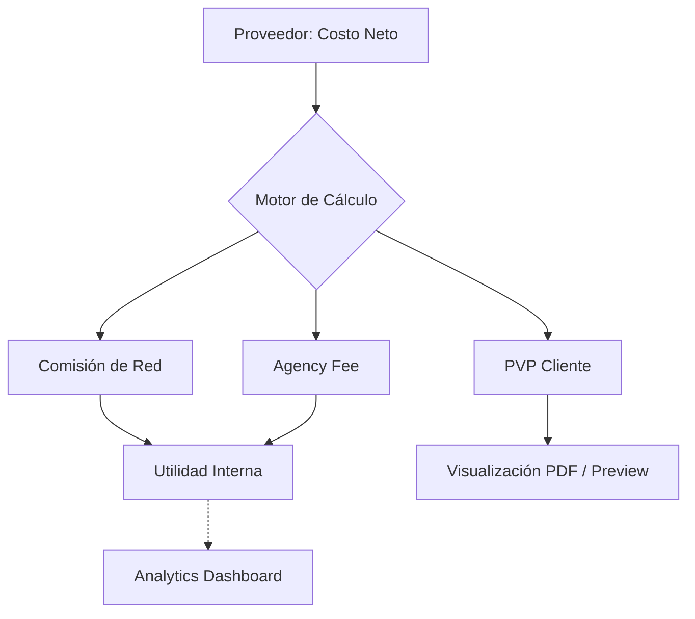

# 💎 TravelPro Quotes — Plataforma Propietaria de Software

[](https://nextjs.org/)
[](https://react.dev/)
[](https://tailwindcss.com/)
[](https://supabase.com/)

**TravelPro Quotes** es la **Plataforma Propietaria de Software** que centraliza el cerebro operativo y motor financiero de la agencia. Diseñada bajo estándares de **Ingeniería de Software 2026**, esta solución corporativa garantiza la creación de cotizaciones de alta fidelidad, la gestión de márgenes netos y la futura integración con el ecosistema CRM, priorizando la rentabilidad y la soberanía tecnológica de la empresa.

---

## 🏗️ Architectural Blueprint

El sistema sigue una arquitectura orientada a dominios con un desacoplamiento estricto entre la lógica de negocio y la infraestructura.

### 1. Unified Financial Engine (Net-Centric Model)
Hemos eliminado la ambigüedad del PVP manual. El sistema implementa un modelo de **Costo Neto + Márgenes Duales**:



- **Inmutabilidad**: Las cotizaciones en estado `APPROVED` se bloquean mediante triggers a nivel de aplicación y esquema.
- **Determinismo**: Motor de cálculo puro (`calculator.ts`) con 0 efectos secundarios, facilitando el testing unitario y la paridad entre plataformas.

### 2. Data Governance & Type Integrity
- **Zod Discriminated Unions**: Implementación de uniones discriminadas para la gestión de estados financieros nacionales vs. internacionales, eliminando el riesgo de "campos fantasma" o estados inconsistentes en la DB.
- **Single Source of Truth (SSOT)**: El `quote-store` (Zustand) actúa como la única fuente de verdad para el estado efímero, mientras que el **DAL (Data Access Layer)** orquesta la persistencia atómica hacia Supabase.

### 3. "Diamond Standard" UI/UX
- **High-Fidelity Document Parity**: Uso de métricas compartidas entre el motor de renderizado de React y `@react-pdf/renderer` para garantizar una fidelidad del 100% entre el simulador web y el documento final.
- **Glassmorphism 2.0**: Estética basada en capas de profundidad táctil y contraste AAA (WCAG 2.1), diseñada para reducir la fatiga cognitiva en sesiones operativas prolongadas.

---

## 🚀 Locked Stack & Ecosystem

| Componente | Tecnología | Rationale |
|------------|------------|-----------|
| **Core** | `Next.js 16.2` | Optimización nativa de Server Components y Server Actions (Idempotent). |
| **Logic** | `React 19` | Aprovechamiento de `use()` hooks para data-fetching y React Compiler para 0 memoización manual. |
| **Styles** | `Tailwind v4` | Arquitectura CSS-First con variables `@theme inline` para máximo performance. |
| **Data** | `Supabase SSR` | Persistencia con RLS optimizado via `InitPlan` para consultas de alta velocidad. |
| **Security**| `Zod` | Validación de contratos en todas las fronteras del sistema. |

---

## 📂 Project Anatomy (Screaming Architecture)

```bash
├── app/                  # Route Handlers & Layout Orchestration
├── features/             # Domain Logic (Slices)
│   ├── quotes/           # The Financial Core (Schemas, Actions, Calculators)
│   ├── ai-extractor/     # LLM Orchestration for Data Ingestion
│   └── dashboard/        # B2B Analytics & KPIs
├── lib/                  # Infrastructure & Shared Services
│   ├── dal/              # Data Access Layer (Strict Security)
│   └── supabase/         # SSR Client Factories
└── __tests__/            # Mission Critical Testing Suite
```

---

## 🛠️ Operational Excellence

### Developer Experience (DX)
- **Strict Linting**: Configuración de ESLint + Prettier para consistencia absoluta.
- **Type-Check Forced**: Validación de tipos obligatoria antes de cada despliegue.
- **Conventional Commits**: Historial de cambios semántico y auditable.

### Setup & Commands
```bash
npm install         # Deterministic dependency resolution
npm run dev         # High-speed development server
npm run test        # Execute Vitest suite (Financial Engine focus)
npm run typecheck   # Static analysis validation
```

---

## 🛡️ Security Posture
- **Isolation**: RLS forzado en cada tabla con políticas `(select auth.uid())` para máxima eficiencia.
- **DAL Encapsulation**: Prohibido el acceso directo a Supabase desde la UI; todo flujo pasa por la capa de acceso a datos validada.
- **Secret Management**: Uso estricto de variables de entorno cifradas y Server Action Encryption.

---

> Built for Scale. Engineered for Trust. **TravelPro Quotes** 2026.
